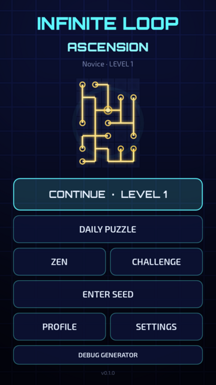
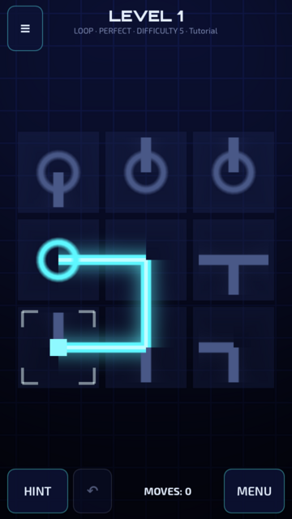
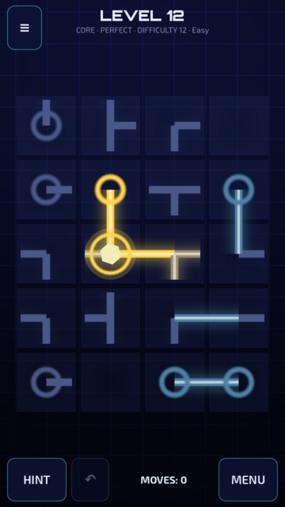
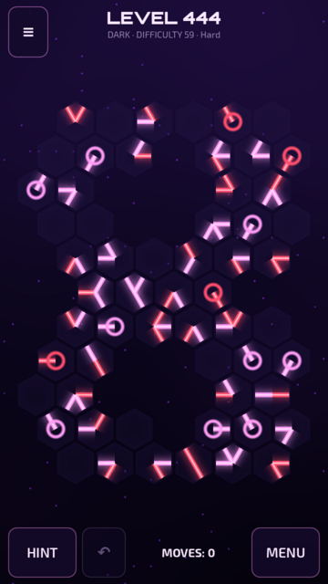
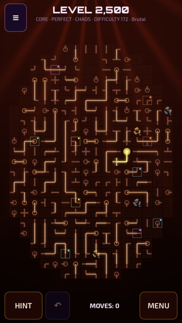
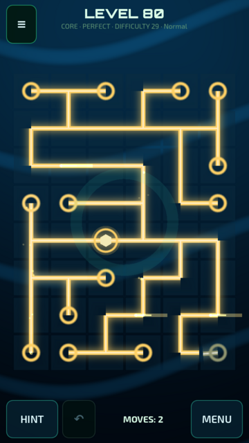
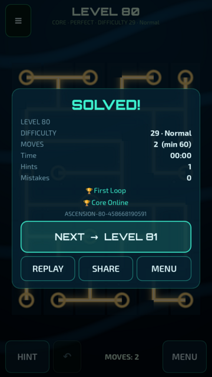
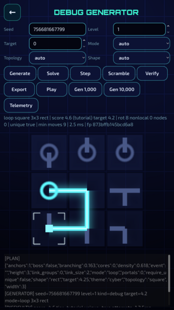

# INFINITE LOOP: ASCENSION

Puzzle mobile (Android, retrato) de girar peças e reconstruir redes de energia, com **geração procedural infinita, determinística e sempre solucionável**. Feito em **Godot 4.7** (renderer Compatibility, GDScript).

> "Eu achei que tinha entendido o jogo. Agora ele ficou absurdo."

| Menu | Nível 1 | CORE | Hex · DARK |
|---|---|---|---|
|  |  |  |  |

| CHAOS (nível 2.500) | Onda de energia na vitória | Resultado | Debug do gerador |
|---|---|---|---|
|  |  |  |  |

## O que já funciona

**Infinitude real** — `Puzzle(N) = Generator(Seed(N), Difficulty(N))`. Nenhuma fase é armazenada; qualquer nível (1, 10.000, 100.000.000, 999.999.999.999) é gerado sob demanda, offline, e a mesma seed sempre gera a mesma fase.

**Gerador em camadas** (seed → plano de dificuldade → topologia → solução válida → mecânicas especiais → embaralhamento → validação → solver → análise de dificuldade → anti-repetição). A fase nasce de uma solução conhecida, então **nunca** é impossível; o solver independente confirma e mede.

**Solver próprio** — propagação de restrições (arc consistency) + poda global de florestas/núcleos + busca MRV com pilha explícita e orçamento de nós (nunca tempo de relógio, para manter o determinismo entre aparelhos). Conta soluções (prova de unicidade para o modo PERFECT) e alimenta as dicas.

**Dificuldade multidimensional e sem teto** — tamanho, densidade, ramificação, topologia (quadrada/hexagonal), formatos irregulares (losango, elipse, cruz, anel, infinito ∞, estrela, orgânico, espiral, buracos), modos, unicidade, portais, peças travadas, peças ligadas, número de núcleos, profundidade de dedução e busca. Faixas: Tutorial → Easy → Normal → Hard → Very Hard → Brutal → Insane → Nightmare → Ascension. Eventos recorrentes (Galaxy a cada 100, Fracture 250, Mega Grid 500, Void 1.000, Chaos 2.500, Ascension 5.000 — para sempre). Dificuldade adaptativa trava um viés no momento em que o nível é gerado (nunca muda um puzzle já mostrado).

**Modos** — LOOP (todas as pontas conectadas), CORE (energia do núcleo a todas as peças), MULTI CORE / FRACTURE (cada região alimentada por exatamente um núcleo), DARK (nenhuma ponta pode tocar outra), PERFECT (solução única), CHAOS (peças ligadas que giram juntas). Jogo: Continuar (progressão infinita), Desafio diário, Zen (aleatório sem repetição recente), Desafio (Hardcore/Insane/Nightmare/Ascension sem dicas), Seed/código compartilhável.

**Mobile first** — toque gira (horário), segurar gira (anti-horário), toque duplo fixa a peça, pinça dá zoom, arrastar move a câmera, toque com dois dedos desfaz; safe area, modo canhoto, retrato, botão voltar do Android, haptics.

**Visual e game feel** — renderizador em lotes (sem um Node por peça), linhas neon texturizadas com brilho, animação de mola em cada rotação, faíscas a cada conexão, núcleos pulsando, portais girando, onda de energia que percorre a rede na vitória com partículas e pulso de câmera, 12 temas (Cyber, Void, Ocean, Forest, Galaxy, Crystal, Digital, Inferno, Ancient, Celestial, Quantum, Monochrome) com fundos em shader.

**Áudio procedural** — todos os efeitos e a música são sintetizados em runtime (zero arquivos de áudio); música em 3 camadas que crescem com a complexidade e com o progresso, resolução musical ao vencer.

**Progressão e persistência** — perfil e estatísticas, 29 conquistas, títulos, estrelas de prestígio, sequência de dias, replay da solução, compartilhamento (texto + imagem), save JSON versionado com checksum SHA-256, backup automático, migração e recuperação de corrupção; cache LRU de fases.

**Ferramentas** — tela DEBUG GENERATOR (seed, nível, modo, topologia, formato, alvo; Generate/Solve/Step/Scramble/Verify/Export; Gen 1.000/10.000), logs `[GENERATOR] [SOLVER] [DIFFICULTY] [VALIDATOR]`, telemetria local, pt-BR e en-US (arquitetura pronta para es, fr, de, ja, ko, zh).

## Rodando

```bash
# Godot 4.7.x (https://godotengine.org/download)
godot --path .                      # abre o jogo
godot --path . -e                   # abre o editor
```

## Testes

```bash
tools/run_tests.sh                                                     # 86 testes unitários
godot --headless --path . --script res://tests/ui_smoke_test.gd -- --ephemeral-save   # UI de ponta a ponta
godot --headless --path . --script res://tests/performance/stress_test.gd -- --count=100000
godot --headless --path . --script res://tools/check_scripts.gd        # compila todos os scripts
```

Resultados e detalhes em [docs/TESTING.md](docs/TESTING.md).

## Android (APK / AAB)

```bash
tools/build_android.sh debug      # build/android/InfiniteLoopAscension-debug.apk
tools/build_android.sh release    # precisa da keystore de release (variáveis de ambiente)
tools/build_android.sh aab        # Google Play (gradle build)
```

Prioridade `arm64-v8a`, APK release ≈ 27 MB. Passo a passo e CI em [docs/BUILD_ANDROID.md](docs/BUILD_ANDROID.md).

## Documentação

- [docs/ARCHITECTURE.md](docs/ARCHITECTURE.md) — módulos, fluxo de dados, renderização, threads
- [docs/GENERATOR.md](docs/GENERATOR.md) — pipeline, seeds, códigos, solver, unicidade, anti-repetição
- [docs/DIFFICULTY.md](docs/DIFFICULTY.md) — curva, DifficultyScore, planner, eventos, adaptação
- [docs/BUILD_ANDROID.md](docs/BUILD_ANDROID.md) — exportação e assinatura
- [docs/TESTING.md](docs/TESTING.md) — testes e stress test de 100.000 fases
- [docs/ROADMAP.md](docs/ROADMAP.md) — status de cada item do escopo

## Licenças

Código do projeto: do autor do repositório. Fontes Orbitron e Exo 2: SIL Open Font License 1.1 (`assets/fonts/OFL-*.txt`). Conceito inspirado na mecânica geral de puzzles de rotação; identidade visual, peças, sistemas e código são próprios.
